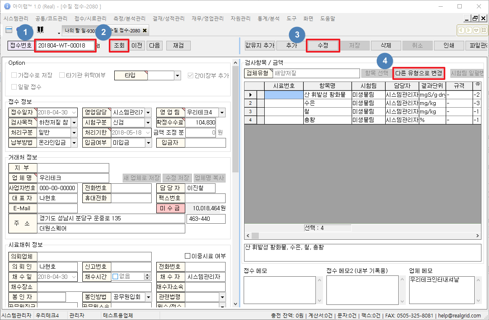

# 접수가 이미 완료된건의 유형을 변경하는 방법

## Q

결과값을 입력한 값을 다른 유형으로 변경하고 싶습니다. 변경이 가능할까요?

## A

해당 분야의 접수화면에서 `다른 유형으로 변경` 버튼을 통하여 수정합니다. 아래 안내를 참고하여 진행합니다.


접수화면에서 `다른 유형으로 변경` 버튼이 보이지 않을 경우, [메뉴 권한 관리 화면](https://help.ilabs.co.kr/10/0201)에 대한 권한을 가지고 있는 사용자에게 권한을 요청하여 진행합니다.


**①** 수정해야할 접수건의 `접수번호`를 입력 합니다.

**②** `조회`버튼을 클릭 합니다.

**③** `수정`버튼을 클릭 합니다.

**④** `다른 유형으로 변경` 버튼을 클릭 합니다.


유형 변경화면에서 검체유형명을 선택할 경우 자동으로 해당 유형의 항목이 모두 선택됩니다




선택된 항목과 함께 **검체유형명** 까지 변경하는 옵션



선택된 항목들로 변경되며 **검체유형명**은 유지하는 옵션




이미 접수한 건의 **검사항목**에 결과값이 입력되어 있는 **항목**이 만약 변경하는 유형에서 같은 판정식과 규격을 가진 **항목**이라면 결과값이 유지된 상태로 변경됩니다.


