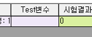
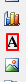
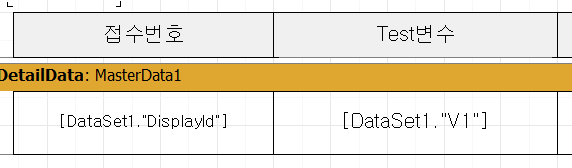

# 시험법 변수 추가 후 사용

## Q

변수를 추가하고, 기록서에 그걸 출력하는 과정이 어떻게 되나요?

알려주세요.

## A

기록서에서 변수를 추가하고 출력하는 방법을 알려 드리겠습니다. A타입, 그리고 C타입 기록서에서 변수를 출력할 수 있는데요. 먼저 시험법 관리에서 변수를 생성을 해야 합니다.

메뉴 : 측정/분석관리 &gt; 시험법 관리

1. 수정하려는 시험법을 선택한 후 "변수 정의" 탭을 선택 합니다.  

   

2. "추가" 버튼을 눌러, 필요한 변수의 정보를 입력합니다.  

   

   순서 : 결과입력 화면에서 입력칸의 순서를 나타냅니다.

   변수명 : 기록서 상에 연동할 때 사용하며 이름은 영어, 숫자, \_ 등을 사용할 수 있습니다.

   한글명 : 결과입력 화면에서 보이는 입력칸의 이름입니다.

   형식 : 입력칸의 속성을 나타냅니다. 가장 기본적인 속성은 string 이며, memo, date, picklist 등을 사용할 수 있습니다.

   표시 : 결과입력 화면에 입력칸을 표시할 지 여부를 결정합니다.

   기본값 : 결과입력 화면에 채워지는 기본값. 

3. 결과등록 화면에서 해당 시험법에 금방 만든 변수가 잘 나타나는지 확인 합니다.  

   

   시험법 관리에서 할 부분은 모두 마무리 하였습니다.

   그럼 실제 기록서 쪽에서의 작업을 알려 드리겠습니다.  

메뉴 : 측정/분석관리 &gt; 시험법 관리 &gt; 리포트 디자이너 버튼  
또는 공통/코드관리 &gt; 리포트 관리 &gt; 해당 리포트

1. 해당 시험법에서 사용할 리포트의 디자인을 엽니다.  
2. 화면 왼쪽 그리기 도구 중에 "A" 라는 아이콘을 클릭 하여 메모 컨트롤을 화면에 올립니다.  

   \(또는 이미 화면에 올라온 메모 컨트롤을 복사하여 붙여넣으셔도 됩니다.\)  

   

3. 메모컨트롤을 더블클릭한 뒤, 시험법관리에서 만들어둔 변수명을 대괄호 \[ \] 로 둘러 싸서 입력 합니다.  

   ▶ A타입 기록서의 경우 \[변수명\]  

   ▶ C타입 기록서의 경우 \[DataSet1."변수명"\]  

    C타입은 DetailData 라는 밴드 내에 변수명을 넣어야 합니다.  

   

4. 실제 출력 하여 결과값이 잘 나오는지 테스트 합니다.

