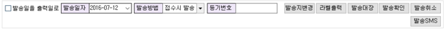

# 한글입력 문제

## Q

조회 조건을 입력하거나 접수 정보를 입력할 때 한글/영문 변환이 제대로 안됩니다.  
분명히 한글로 변환한 다음 입력하고 다음 칸으로 이동하면 다시 영문으로 바뀌어 있습니다.  
해결할 수 있는 방법을 알려주세요.

## A

입력칸에서 한글 / 영문 변환 오류에 대해 답변 드리겠습니다. 이 문제는 윈도우와 오피스의 한글 입력기때문에 발생하는 문제입니다. Windows7에서 키보드의 한글 입력 장치를 제어하는 서비스중 고급 텍스트 서비스와 아이랩 프로그램간의 호환성 문제가 원인입니다.

이 문제를 해결하기 위해 다음과 같은 방법으로 서비스설정을 수정해 주어야 합니다. 1. 제어판을 실행합니다. 1. 시계 언어 및 국가별 옵션에 키보드 또는 기타 입력방법 변경을 실행 합니다. 


 1. 키보드 변경 버튼을 클릭 합니다. 1. 현재 활성중인 한글 입력 언어를 확인 합니다. 


```text
화면에서 Microsoft IME 2010 과 같이 선택된 본인의 PC 에 설치된 입력기가 어떤 이름으로 되어 있는지 확인하고 아래쪽 설치된 서비스 부분에서 해당 입력기를 선택 하고 속성 버튼을 클릭 합니다. 
```

만약 Microsoft IME 2010 또는 Microsoft Office IME 2007 이 보이지 않는다면 아래 링크에서 다운로드 할 수 있습니다. 

[http://www.microsoft.com/ko-kr/download/details.aspx?id=30390](http://www.microsoft.com/ko-kr/download/details.aspx?id=30390)

 다운로드 하여 설치후 다음으로 진행 합니다. 1. 한글 입력기 속성 창에서 호홖성 설정 버튼을 클릭 합니다. 


 1. 호환성 설정에 “한글 입력기에서 고급 텍스트 서비스 사용 안함”에 체크 합니다.


 1. 이제 컴퓨터를 재시작 하면됩니다.



