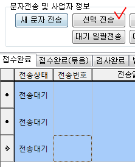

# SMS전송관리

·아이랩에서 사용하는 각 접수건의 상태에 맞게 생성된 문자메시지를 보내거나 확인하는 화면입니다.  
·각 접수건 상태에 대한 문자 메시지생성은 옵션에 따라 자동 생성되며, 모든 문자메시지는 자동전송이 지원되지 않습니다.  
·문자, FAX, 전자세금계산서 사용을 원하신다면반드시 바로빌 서비스에 가입되어있고, 충전금액이 남아있어야 합니다.  
\(아이랩을 처음 설치할 때 또는 사용 중 언제라도 가입 가능하며, 우리테크에 문의주시면 안내해드리겠습니다.\)

| 기능별 사용금액 |
| :---: |

| 문자메시지 | FAX | 세금계산서 |
| :--- | :--- | :--- |
| 55 \(VAT 포함\) | 165 \(VAT 포함\) | 165 \(VAT 포함\) |

·충전금액은 해당 화면 중간에 표기가 되며, 아이랩 사용시 화면 우측 하단에도 항상 표기 되어집니다.

**SMS전송관리 화면 중간**

**아이랩 우측 하단**

·접수건 상태별 문자메시지 생성시점은 도구 -&gt; 옵션 -&gt; 기관별 설정에서 할 수 있습니다.

\(

한명이 설정하면 기관내에 일괄 적용되니 충분한 상의 후 적용해주세요.

\)

**묶음 문자**

특수한 목적으로 만들어진 부분이기 때문에 기본 매뉴얼 설명에서는 다루지 않습니다.

## 조회

설정을 통해 생성된 문자메지시를 각 상태별로 조회 해 볼 수 있습니다.

\(

묶음 문자는 특수한 목적으로 만들어진 부분이기 때문에 기본 매뉴얼 설명에서는 다루지 않습니다.

\)

접수완료: 아이랩 접수화면에서 신규 접수건이 저장 되었을 때 생성된 메시지입니다.

검사완료: 접수된 모든 항목에 대한 검사가 완료 되었을 때 생성된 메시지입니다.

발행완료: 접수건에 대한 성적서가 발행된 후에 생성된 메시지입니다.

발송완료: 접수건에 대한 성적서 발송처리가 완료된 후에 생성된 메시지입니다.

가접수: 접수건을 가접수 하였을 때 생성된 메시지입니다.

기타: 위에 상태들을 제외한 메시지

## 메시지 변경

해당 화면에서 메시지를 확인 한다는 것은, 이미 각 접수건의 메시지가 생성된 후 일 것입니다.

이미 해당 접수건과 관련하여 메시지가 고정되어 생성되기 때문에 메시지 내용을 변경하시려면

조회된 목록에서 변경하고 싶은 메시지를 더블 클릭합니다.

\(

한 행을 더블 클릭 하시면 됩니다.

\)

팝업 창이 열린 후 원하시는 메시지로 수정 -&gt; 저장하시면 됩니다.

## 버튼설명

**새문자전송**

 자동으로 생성된 메시지가 아닌 사용자가 원하는 메시지를 입력하여 문자를 전송 할 때 사용합니다.

공통/코드관리 -&gt; 공통코드관리 -&gt; 분류 -&gt; 문자 사용구에있는 목록에 팝업 하단에 표기 되며,

원하는 내용이 있는 경우 더블클릭하여 문자메지시를 불러올 수 있습니다.

받는 사람 목록에 문자메시지를 받을 분의 이름, 연락처를 입력한 뒤 보내기 버튼을 클릭하시면 문자메시지가 전송됩니다.

**전화번호 그룹**

전화번호 목록을 그룹화하여 관리할 수 있습니다.

공통/코드관리 -&gt; 전화번호그룹관리 화면에서도 동일하게 관리하실 수 있습니다.

**그룹추가**  
그룹을 추가합니다.

**그룹삭제**  
선택한 그룹을 삭제합니다. 그룹 안에 전화번호가 등록되어있었다면 전화번호를 모두 삭제 후 그룹을 삭제 해야 합니다.  
전화번호그룹관리에서는 삭제 이력을 남기고 있지 않으니 참고하세요.

**추가**  
그룹안에 전화호를 추가 할 때 사용합니다.  
행이 추가된 후 각각의 열에 원하시는 값을 입력한 뒤 엔터를 치시면 자동 저장되어집니다.

**삭제**  
선택한 전화번호를 삭제합니다.  
전화번호그룹관리에서는 삭제 이력을 남기고 있지 않으니 참고하세요.

**선택**  
이 버튼은 sms전송관리 화면에서만 보여지며, 입력한 문자메시지를 받아볼 사람을 선택 하는 기능입니다.

**취소**  
선택한 전화번호가 있더라도 받는 사람 목록에 추가되지 않고, 팝업창을 닫습니다.

**선택전송**

조회된 목록에서 선택한 모든 문자메시지를 목록에 받는 사람의 번호로 전송합니다.

한개의 행 선택 시 메시지 1건만 보내지고, 여러행 선택 시 각각의 전화번호로 각각의 내용이 전송됩니다.

다중 선택 시 받는 사람 연락처가 없는 경우, 해당 내용은 건너뛰고 다음 행의 메시지들이 보내집니다.

**-&gt;**

**대기 일괄전송**  
조회된 목록에서 아직 전송되지 않은 즉 전송상태가 ‘전송대기’ 인 메시지를 일괄로 전송합니다.  
조회된 목록이 많은 경우바로빌 충전금액이 일괄 소진되기 때문에 조회된 목록의 메시지들이 보내져도 되는 것인지  
반드시 확인 후 이용하시기 바랍니다.소진된 금액은 복구되지 않습니다.

**선택삭제**  
조회된 목록에서 선택한 메시지를 삭제 합니다.  
삭제된 메시지는 이력을 남기지 않기 때문에 복원 할 수 없습니다.

**예약전송취소**  
현재는 사용하지 않는 기능입니다.

**상태 업데이트**  
선택한 메시지의 전송상태를 갱신합니다.  
메시지 전송 후 자동으로 상태를 갱신하지 않기 때문에 다시 조회하거나, 메시지 선택 후 상태 업데이트 버튼을 눌러 해당 메시지의 현재 상태를 알 수 있습니다.  
\(메시지 전송 후 반드시 해야 하는 것은 아닙니다.\)

**전송상태확인**

선택한 메시지의 전송상태를 확인합니다.

바로빌 홈페이지에서 접속하여 사용하는것과 같은 페이지가 팝업되며 문자전송내역을 원하는 조회 조건으로 조회하여 확인해 볼 수 있습니다.

**사업자 정보 보기**

바로빌 서비스를 사용하기 위하여 아이랩과 바로빌에 등록되어있는 해당 기관의 사업자 정보를 확인합니다.

바로빌 서비스 이용을 위한 담당자 지정

\(

우리테크에서 사업자 및 담당자 추가 후 이용가능합니다.

\)

, 공인인증서, 바로빌 금액 충전을 진행 하실 수 있습니다.

바로빌을 여러명이 사용할 경우 아이랩에서 바로빌 연동의 담당자를 선택하여 지정 할 수 있습니다.

**자동전송 설정**  
현재는 사용하지 않고 있습니다.

