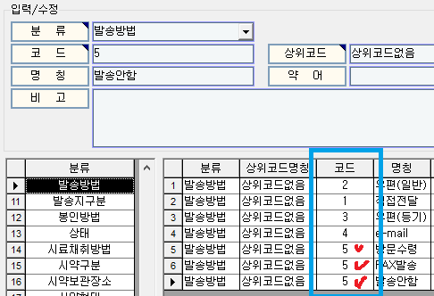
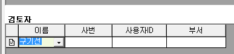
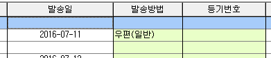

# 발송관리

아이랩을 통해 성적서가 발행된 접수건에 한해서 출력된 종이 성적서를 우편으로 발송하는 경우, 해당 발송정보들을관리 할 수 있는 화면입니다.

성적서에 바코드를 표기하여 종이로 출력하셨다면 해당 화면에서 바코드 스캐너를 이용하여, 창봉투에 표기 되는 바코드를 인식 시켜 관리 할 수도 있습니다.

접수건의 상태가 “발” 또는 “■” 인 접수건만 조회할 수 있습니다.

화면구성

## 조회

각 조회조건을 입력하여 접수건을 조회합니다.

“미발송” 탭에서는 아직 발송처리가 되지 않은 접수건을 조회합니다.

“전체” 탭에서는 미발송 접수건, 발송 접수건을 모두 조회합니다.

조회영역은 아래 캡쳐와 같이 위쪽 영역만 해당합니다.

버튼이 위치한 화면 중간영역은 조회 조건이 아닌 입력 조건입니다.

예

\)

 성적서관리화면에서 접수건 상태를 확인 -&gt; 발송관리에서 조회

## 버튼설명

**발송지변경**

접수화면 -&gt; 우편발송지 정보 부분에 저장 되어 있는 발송지 주소를 변경할 수 있는 기능입니다.

\(

접수화면에서 우편발송지 정보 부분에서 수정하실수도 있습니다.

\)

접수된 우편발송지 정보와 실제 성적서를 우편으로 보내야하는 발송지가 다를때 사용하시면되겠습니다.

변경후에는 접수화면 -&gt; 우편발송지 정보도 함께 변경됩니다.

**라벨출력**

선택된 접수건을 라벨용지로 출력해주는 기능입니다. 라벨용지는 아이랩 상단 메뉴 중 공통/코드관리 -&gt; 리포트관리 2.0 화면 -&gt; 라벨 탭에

“스마트주소라벨” 또는 “주소라벨” 이라는 양식이 등록 되어 있어야 하고, 우리기관이 어떤 양식을 사용하는지 궁금하시면 서비스요청 보내주세요.

확인하여 답변 드리겠습니다.

**발송대장**

선택된 접수건을 발송대장 양식으로 출력해주는 기능입니다. 발송대장 양식은 아이랩 상단 메뉴 중 공통/코드관리 -&gt; 리포트관리 2.0 화면 -&gt; 대장 탭에 “발송대장” 이라는 이름으로 양식이 등록되어있어야 사용 가능 합니다.

**발송확인**

미발송 탭에서 조회된 접수건들에 대하여 발송처리를 하는 기능입니다.

그리드 목록 왼쪽에 체크 된 접수건에 한해서만 처리됩니다.

화면 중간 영역에서 지정한 발송일자, 발송방법, 등기번호로 체크된 접수건에 대한 발송처리가 이루어집니다.

화면 중간 영역에 있는 발송방법 부분은 아이랩 상단 메뉴 중 공통/코드관리 -&gt; 공통코드관리 -&gt; 분류 목록 중 발송방법에 등록되어있는 정보들이 표기되어집니다.

※주의 사항

발송방법 등록시 코드부분이 중복되지 않도록 해주셔야 발송관리화면에서 오류 없이 조회되어집니다.

공통코드 등록방법은 공통코드관리 매뉴얼을 참고해주세요.

\(

\[

[http://cafe.naver.com/labtools/book3662099/7](http://cafe.naver.com/labtools/book3662099/7)

\] \(

[http://cafe.naver.com/labtools/book3662099/7\)\](http://cafe.naver.com/labtools/book3662099/7%29\)

\)

아래 예시를 보시고 참고해주세요.

그리드 목록에서 다중 선택하는 방법은 아래 공통 매뉴얼 부분을 참고해주세요.

예

\)

그리드에서 여러 접수건을 선택 -&gt; 선택/취소 버튼을 통해 일괄 선택 및 일관 선택해제를 할 수 있습니다.

동영상을 참고해주세요.

**발송취소**

발송이 완료된 접수건에 한해서 발송취소를 진행합니다.

발송취소가 진행되면 입력했던 발송일, 발송방법, 등기번호는 초기화됩니다.

예

\)

**발송SMS**  
선택한 접수건 중 발송처리가 끝난 접수건에 한하여 한번에 한개씩 sms문자 메시지를 전송할 수 있습니다.  
바로빌 충전잔액을 사용하게되며, 바로빌을 사용하지 않고 있는 기관이라면 사용할 수 없습니다.

