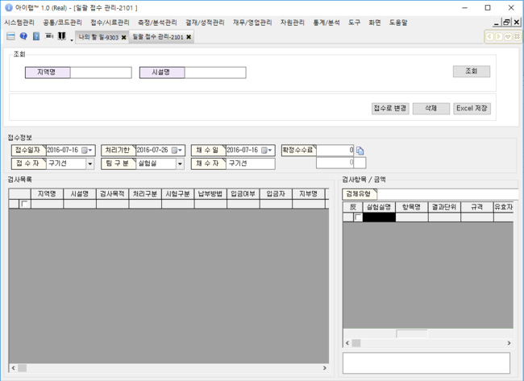

# 일괄접수관리

특정업체 또는 공공기관 등 주기적으로 검사의뢰를 진행해야 하는 경우, 주기적으로 검사 해야 하는 항목들을 접수건 별로 미리 등록해두고, 정기 검사 시점에 맞추어 등록해 둔 접수건의 기본정보만 바꾸어 실제 접수건으로 변경하여 사용할 수 있는 기능입니다.

해당 기능을 이용하고 싶다면, 아이랩 상단 메뉴 중 접수/시료관리 -&gt; 통합접수목록 -&gt; 접수건 조회 -&gt; 정기검사목록 버튼을 이용하여 최초 한번은 등록을 해주셔야 사용할 수 있습니다.

버튼이 많지 않으니, 접수로 변경 방법과 삭제 및 Excel 저장 부분으로 나누어 안내하겠습니다.

화면구성-

## 조회

통합접수목록 화면에서 등록한 지역명, 시설명으로 조회할 수 있고, 아무것도 입력하지 않는다면

정기검사목록으로 등록된 모든 접수건을 조회하실 수 있습니다.

접수건이 많다면 조회시간이 다소 걸릴 수 있습니다.

## 접수로변경

미리 등록해둔 정기검사목록을 조회합니다.

기본정보를 확인하고 실제 접수건으로 만들 접수건을 체크합니다.

실제 접수되어야 하는 검체유형을 조회하고, 접수되어야 하는 항목을 체크 합니다.

\(

화면 좌측 검사목록에서 체크된 접수건들에 모두 동일하게 적용됩니다.

\)

화면 중간 영역에 있는 기본정보들을 실제 등록되어야 할 정보들로 변경합니다.

\(

접수일, 처리기한, 채수일, 확정수수료 등

\)

※접수일자 변경시 처리기한이 자동으로 바뀌지 않으니 처리기한 변경이 필요하시다면 수기로 변경해주셔야 합니다. V 

별도 저장 기능은 없고, 접수로변경 버튼을 클릭하면 화면에 좌측 검사목록에서 선택된 내용이 우측에 검체유형 및 항목 + 화면 중간영역에서 수정한 정보들로 변경되어 실제 신규 접수건으로 생성되어집니다.

신규 생성되는 접수번호는 각 기관의 접수번호 생성규칙에 따르며, 신규생성된 후에는 접수화면 또는 통합접수목록 화면 등에서 확인 하실 수 있습니다.

## 삭제 및 Excel

**삭제**  
주기적으로 생성하던 접수건이 필요없거나 정기검사목록관리를 위해, 좌측 검사목록에서 체크한 접수건을 삭제 할 수 있습니다.  
최종 삭제 메시지 후에 체크된 접수건이 삭제되어집니다.  
실제 접수건에 영향을 주는 부분이 아니므로 별도 이력을 남기고 있지 않으니 참고해주세요.

**Excel로 저장**

좌측 정기검사목록에 있는 내용들이 엑셀파일로 저장되어지며, “지역별일괄접수관리”라는 파일명으로 아이랩 설치 폴더/excel 폴더에 저장되어집니다.

