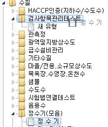
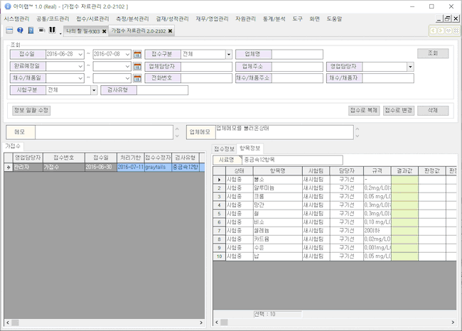
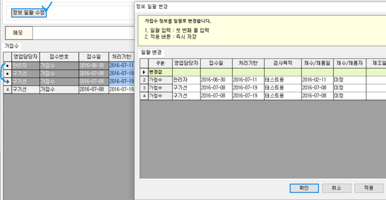
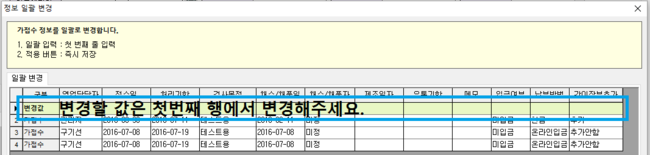
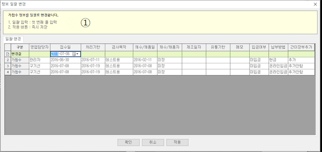
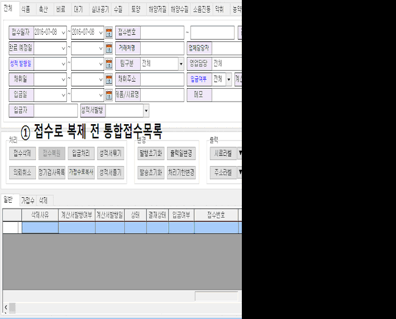
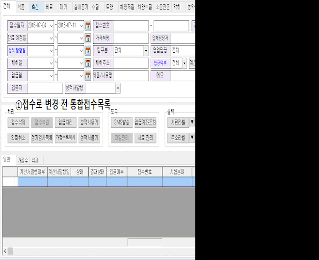

# 가접수 자료관리

실제 아이랩 데이터들과 연동되지 않는가짜데이터를 의미하는가접수 건을 관리하는 화면입니다.  
가접수 건을 실제 접수건으로 복제 또는 변경하는 경우에는 실제 데이터로 변경되어집니다.  
기관내에서 정기적 또는 일부 업체에서 접수되는 시료에 대하여기본 정보 및 항목정보를 미리 저장해두고,  
필요에 따라 실제 접수건으로 변경하여 다수의 접수건을 빠르게 생성할 수 있도록 할 수 지원하는 화면입니다.  
가접수 건 생성은 접수매뉴얼 또는 통합 접수목록 매뉴얼에 내용이 포함되어있지만,  
한번 더 다루도록 하겠습니다.

**화면구성**

## 조회

조회영역에 있는 조회조건을 입력하여 입력한 조회조건이 포함된 가접수건이 있는지 조회합니다.

조회된 내용은 화면 좌측 하단 “가접수” 탭에 행 단위로 표기되어집니다.

각 가접수건에 따라 화면 우측 하단 “접수정보”, “항목정보”탭에 상세 정보가 조회 되어 집니다.

## 버튼설명

**정보 일괄 수정**

가접수건의 정보를 변경하여 실제 접수건으로 복제 또는 변경하려는 경우

선택한 가접수건을 변경 할 내용을 일괄로 처리하는 기능입니다.

변경할 정보는 첫번째 행, 변경할 컬럼의 내용을 변경해주세요.

접수일자 수정시에는 보통의 경우 접수일자에 따른 처리기한이 정해져있기 때문에 처리기한도 함께 변경 할지에 대한 메시지가 나타납니다.

정보를 변경한뒤에는 확인 또는 적용버튼으로 변경된 내용을 반영해주세요.

예

\)

**접수로 복제**

선택된 가접수건의 가접수 데이터를 보존하고, 선택된 가접수의 갯수만큼 신규 접수건을 생성합니다.

신규 접수건의 접수번호는 각 기관별 생성규칙에 따라 접수로 복제 버튼 클릭 시점의 가장 마지막 일련번호 +1로 적용됩니다.

신규 접수건 확인은 아이랩 상단 메뉴 중 접수/시료관리 -&gt; 각 분야별 접수화면 또는 통합접수 목록 화면 등에서 접수번호를 조회할 수 있는 화면들에서 확인 할 수 있습니다.

예

\)

가접수건 선택 -&gt; 접수로 복제 버튼 클릭 -&gt; 접수/시료관리 -&gt; 통합접수목록에서 조회하여 확인해보았습니다.

**접수로 변경**

선택된 가접수건의 가접수 데이터를 보존하지 않고, 선택된 가접수의 갯수만큼 신규 접수건을 생성합니다.

신규 접수건의 접수번호는 각 기관별 생성규칙에 따라 접수로 변경 버튼 클릭 시점의 가장 마지막 일련번호 +1로 적용됩니다.

신규 접수건 확인은 아이랩 상단 메뉴 중 접수/시료관리 -&gt; 각 분야별 접수화면 또는 통합접수 목록 화면 등에서 접수번호를 조회할 수 있는 화면들에서 확인 할 수 있습니다.

**삭제**

선택한 가접수건을 최종 삭제 메시지 진행 후 삭제 합니다.

가접수건은 실제 데이터와 연결되지 않는 부분이기 때문에 별도의 삭제 이력을 남기지 않습니다. 참고해주세요.

