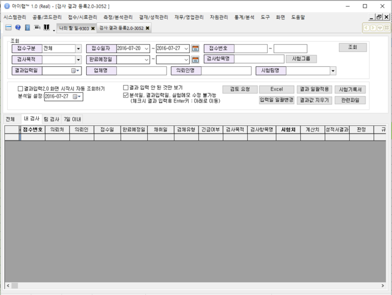
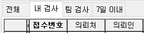
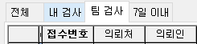
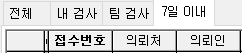
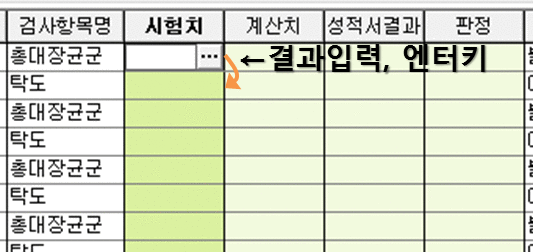

# 결과등록 2.0\(=시험결과입력2.0\)

아이랩을 통해 접수된 항목에 대해 시험법 구분 없이 빠르게 결과값을 입력 할 수 있는 화면입니다. 각 항목의 시험결과값은 검사결과등록2.0, 검사결과등록3.0, 검사결과등록4.0, 접수별 결과 일괄 입력 화면에서 입력할 수 있고, 각 화면은 목적에 따라 조회되는 모양이 다르기 때문에 기관내에서 각 화면의 목적에 맞게 이용하시면 업무에 도움이 되실 것 입니다.\(결과입력은 모든 화면에서 가능합니다.\) 예\) 각 화면의 매뉴얼을 참고하시면 이해가 빠르실 것 같습니다.

·검사결과등록2.0 - 시험법 구분 없이 결과값만 빠르게 입력.  
·검사결과등록3.0 - 시험법이 연결 되어 있는 항목들을 조회\(시험법 기준\) 계산식 변수 입력, 시험 결과치 입력  
·검사결과등록4.0 - 시험법이 연결 되어 있는 항목들을 조회\(접수건 기준\) 계산식 변수 입력, 결과값 입력  
·접수별 결과 일괄 입력 - 잔류농약 분야에서만 사용 가능, 선택한 접수건에 따라 모든 항목에 같은 결과값을 입력. 개별 입력 가능

**화면구성-**

## 조회

조회하려는 조회조건 입력후 화면 중간에 있는 각 탭별로 조회되는 내용이 달라집니다.  
※ 전체 탭은 도구 -&gt; 메뉴권한관리 -&gt; 검사결과입력2.0 -&gt; 전체조회탭에 권한이 있어야만 사용 할 수 있습니다.

**조회 탭 설명**

기본적으로 내 검사 탭이 선택됩니다.

**전체**

※ 메뉴권한관리 화면에서 지정한 권한에 따라 표기가 되지 않을 수 있습니다.

조회조건에 입력한 조건대로 접수건을 조회합니다.

**내 검사**

조회하려는 접수건에 대하여 항목 담당자가 본인인 항목만 조회가 됩니다.

**팀 검사**

조회하려는 접수건에 대하여 항목의 담당팀이 자신이 속해있는 시험팀인 항목만 조회가 됩니다.

자신의 시험팀은 측정/분석관리 -&gt; 시험팀 관리 화면에서 확인 할 수 있습니다.

\(

시험팀 관리 메뉴가 보이지 않는다면 관리자분께 메뉴권한을 달라고 요청하세요.

\)

**7일 이내**

해당 화면을 이용하는 날짜를 기준으로 처리기한이 7일 이내인 접수건만 조회됩니다.

예

\)

2016년 7월 24일에 해당 화면 -&gt; 7일이내 탭에서 조회한다면, 접수 건 중에서 처리기한

\(

완료예정일

\)

이

7월 24일 + 7일인 7월31일까지의 접수건이 조회됩니다.

**조회 옵션**

※실제 결과입력시에 분석일 설정에 입력되어있는 날짜로 해당 항목의 분석일이 입력됩니다.

화면 중간에 있는 체크박스들이 조회옵션입니다.

기본적으로 분석일, 결과입력일, 실험메모 수정 불가능에 체크가 되어있습니다.

\(

빠르게 결과값만 일력하기위한 설정입니다.

\)

**결과입력2.0 화면 시작시 자동 조회하기**

해당 화면을 처음 열었을 때 기본적으로 입력 되어 있는 조회 조건으로 자동 조회 하는 옵션입니다.

이 설정은 해당 화면이 닫힐 때 설정이 저장되어 다음에 화면을 열 때부터 적용됩니다.

해당 옵션이 체크 되어 있다면, 자신에게 담당된 항목이 많은 경우, 화면이 열리는 시간이 다소 오래 걸릴 수 있습니다.

\(

화면이 열릴 때 한번만 조회 되고, 그 이후에는 조회 버튼을 이용해주세요.

\)

**결과 입력 안 된 것만 보기**

입력한 조회조건중에서 결과값이 입력되지 않은 항목만 조회합니다.

**분석일, 결과입력일, 실험메모 수정 불가능**  
해당 화면의 목적인 빠른결과값입력을 위한 설정이므로 기본적으로 선택이 되어있습니다.  
·체크 : 그리드\(목록\)에서 다른 입력칸들은 입력불가, 결과값만 빠르게 입력합니다.  
·미체크 : 그리드\(목록\)에서 결과값, 분석일, 결과입력일 실험메모를 입력 할 수 있습니다  
\(엔터키 입력시 오른쪽 순서대로 이동합니다. 결과값 -&gt; 분석일 -&gt; 결과입력일 -&gt; 실험메모 -&gt; 다음행\)  
자세한 동작은 결과입력 부분에서 참고해주세요.

## 버튼설명

**검토요청**  
· 아이랩에서 3단 결재\(시험, 검토, 승인\)를 사용하는 기관에서만 해당 내용을 참고하시면 되겠습니다.  
해당 화면에서 검토요청을 한다면 해당 항목의 담당자가 속해있는 시험팀의 검토자분에게 결재 요청이 되어집니다.  
검토자 확인은 측정/분석관리 -&gt; 시험팀 관리 -&gt; 시험팀 목록에서 자신이 속한 시험팀을 선택 -&gt; 우측 중간에 검토자 부분을 확인해주세요.

**Excel**  
현재 조회된 목록을 화면에 보이는 그대로 엑셀파일로 변환합니다.  
저장경로는 아이랩이 설치된 폴더 -&gt; Excel 폴더 -&gt; 검사결과서\_오늘날짜시간.xls로 저장됩니다.

**입력일 일괄 변경**  
검사결과등록3.0 화면과 동일한 기능

**결과 일괄적용**  
검사결과등록3.0 화면과 동일한 기능

**결과값 지우기**  
검사결과등록3.0 화면과 동일한 기능

**시험기록서**  
아이랩 상단메뉴 -&gt; 공통/코드관리 -&gt; 리포트 관리 -&gt; 기록서 탭에 등록되어있는 기록서를 보여주는 기능입니다.  
해당 기능은 해당 화면이 아닌 다른 화면에서 이용해주세요.  
\(아이랩 상단메뉴 -&gt; 측정/분석관리 -&gt; 검사결과등록3.0 또는 시험결과서 출력 화면 등\)

**관련파일**  
검사결과등록3.0 화면과 동일한 기능

**결과입력**

화면 중간에 분석일, 결과입력일, 실험메모 수정 불가능에 체크되어있는 상태와 체크되어있지 않은 상태를 비교하여 설명합니다.

※실제 결과입력시에 분석일 설정에 입력되어있는 날짜로 해당 항목의 분석일이 입력됩니다.

&lt;체크&gt;

&lt;미체크&gt;

