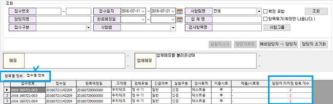
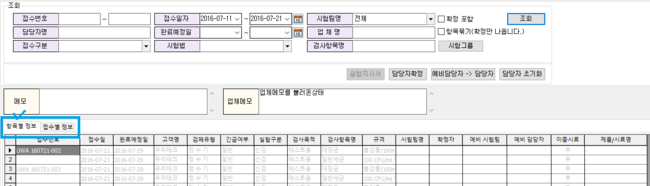
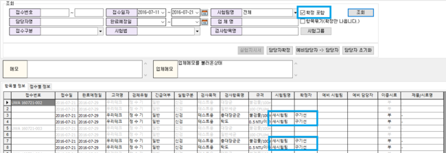
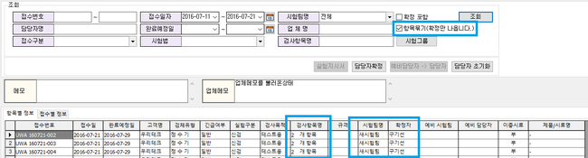
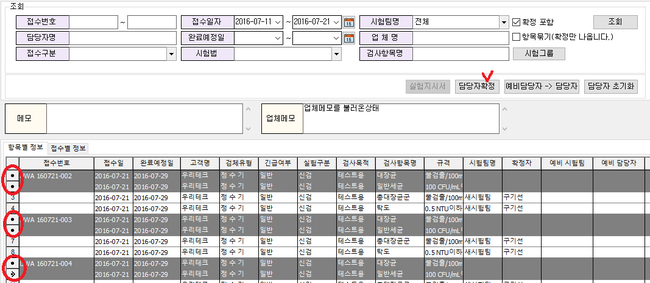
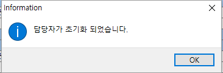

# 검사계획관리

아이랩을 통해 접수된 항목의 담당자를 변경할 수 있는 화면입니다.  
※ 접수된 항목의 결과값이 입력되지 않은 항목만 조회할 수 있습니다.  
항목이 접수되었지만 항목 담당자가 휴가 또는 개인적인 사정 등으로 인해 항목 담당자가 검사기간 내에 해당 항목의 검사를 처리하지 못하는 경우, 다른 담당자로 변경하여 처리할 수 있도록 하기 위함입니다. ※선택한 접수건에만 시험팀, 담당자가 지정 되는 것입니다.\)  
해당 매뉴얼은 검사계획관리 화면에서 파생된 검사계획관리2.0 화면으로 작성합니다.  
두 화면의 차이점은 화면구성과 예비 담당자 기능 부분이고, 그 외 기본 개념과 기능들은 모두 동일하니 참고해주세요.

**화면구성-**

## 조회

조회조건을 입력하여 담당자가 아직 배정되지 않은 항목을 조회 할 수 있습니다.

기본 조회조건은 각 조회 조건을 보고 원하시는 조회 조건으로 조회 하시면 되겠습니다.

항목별 조회, 접수별정보 탭으로 구분되어있습니다.

항목별 정보탭 : 각 접수건 각 항목별 정보가 나오게 되어 집니다.

접수별 정보탭 : 각 접수건로 묶어서 조회되며, 담당자가 지정되지 않은 항목을 표기합니다.

&lt;항목별 정보 탭&gt;

&lt;접수별 정보 탭&gt;

아래는 확정포함 체크, 항목묶기

\(

확정만 나옵니다

\)

 체크, 시험그룹 버튼에 대하여 안내합니다.

### 확정포함 체크

기본적으로 확정포함은 체크 해제된 상태입니다.

확정포함 미 체크 : 조회하려는 접수건에 항목 담당자가 지정되지 않은 항목만 조회됩니다.

확정포함 체크 : 조회하려는 접수건에 항목 담당자가 지정되지 않은 항목, 지정된 항목 모두 조회됩니다.

&lt;확정포함 미 체크&gt;

&lt;확정포함 체크&gt;

### 항목묶기\(확정만 나옵니다\) 체크

항목 정보가 아닌 접수정보로 모아서 조회 할 때 사용합니다. 해당 기능은 조회하려는 접수건에

항목 담당자가 지정된 항목만 조회됩니다.

### 시험그룹 버튼

해당 화면에서는 검사 항목명을 다중으로 입력하여 원하는 항목만 조회 할 수 있습니다.

\(

콤마

\(

 ”,” 

\)

 단위로 항목명을 입력하여 사용해주세요

\)

더불어 시험그룹 버튼을 이용하여 자주 조회하는 항목들을 미리 등록해두고 불러와서 빠르게 입력해 주는 기능입니다.

## 버튼설명

**실험지시서**  
현재 사용하지 않는 버튼입니다.

**담당자확정**

조회된 목록에서 선택한 항목의 담당자를 지정하는 기능입니다.

여러 항목을 선택하여 한번에 담당자를 지정할 수도 있습니다.

※ 항목별 정보 탭에서만 활성화됩니다.

담당자를 지정 할 항목 선택 -&gt; 담당자 확정 버튼 클릭 -&gt; 시험팀, 담당자를 지정 -&gt; 확인 버튼클릭

 -&gt; 

**예비담당자 -&gt; 담당자**

예비담당자는 아이랩 상단 메뉴 중 측정/분석관리 -&gt; 검사 항목 관리 화면에서 각 검체유형 -&gt; 항목 -&gt; 기본 항목 담당자를 지정하지 않고, 각 기관내에서 직접 접수건의 담당자를 판단하여 지정할 때 사용합니다.

※ 각 검체유형 -&gt; 각 항목의 등록되어있는 예비 시험팀, 담당자에 있는 담당자를 실제 담당자로 변경합니다.

변경 후에도 예비 시험팀, 담당자는 유지되어집니다.

\)

예비담당자는 사용을 원하는 기관에만 일괄 적용해 드리고 있기 때문에 기본 담당자를 제외한 담당자 지정이 필요 하신 경우 서비스요청으로 문의해주세요.

**담당자 초기화**

선택한 항목의 지정되어있는 담당자를 초기화 합니다.

