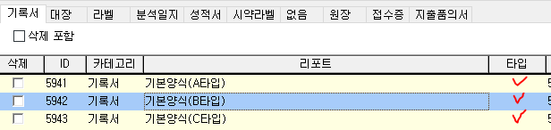

# 시험결과서출력

아이랩에서 접수된 항목들에 대한 기록서 또는 분석일지를 출력 할 수 있는 화면입니다.

※ 기록서, 분석일지 사용을 위해서는 항목들이 반드시 시험법과 연결되어 있어야 합니다.

아이랩에서 사용할 수 있는 기록서는 기본적으로 A, B, C타입으로 나뉘어집니다.

신규로 추가하고 싶은 양식이 있다면, 서비스 요청으로 출력물의 예시\(.hwp, .pdf, .xlsx 등 파일을 보내주세요.\)와 함께 서비스 요청 보내 주시면 사용 가능 여부를 확인하여 답변 드리겠습니다.

**화면구성-**

## 조회

※ 접수건별 항목을 조회하는 것이기 때문에 조회기간이 길고, 하나의 접수건 별로 접수된 항목이 많은 경우, 해당 화면에 조회 속도가 느릴 수 있습니다. 참고해주세요.

※ 조회된 목록은 같은 접수건이더라도, 시험법 별로 구분되어 조회 되어 집니다.

\(분석일지 탭만 접수건별 조회목록으로 표기됩니다.\)

시험법에 있는 기록서를 사용자가 지정하여 출력하는 방식이기 때문에 예를 들어, B타입 기록서로 출력하는 시험법이더라도 A타입에서 조회는 할 수 있습니다. 다만 시험법에 연결되어 있는 기록서가 B타입이기 때문에 A타입에서 조회 -&gt; 기록서 인쇄를 하면 오류가 날 것입니다.\(반대의 경우도 마찬가지 입니다.\)

이럴 때는 B타입 탭에서 다시 조회하셔서 출력해주세요.

## 버튼설명

**리포트디자인**

선택한 시험법에 연결되어 있는 기록서를 리포트디자이너로 확인 또는 수정하여 적용하기 위해 사용합니다.

사용 방법은 공통/코드관리 -&gt; 리포트관리 -&gt; 리포트 디자이너 버튼 기능과 동일합니다.

**시험법 편집**

선택한 시험법에 대한 정보를 확인 또는 수정을 하기 위하여 사용합니다.

사용 방법은 측정/분석관리 -&gt; 시험법 관리 화면과 동일하고, 해당 화면에서 빠르게 확인 및 수정하여 적용하기 위해 사용합니다.

**기록서 인쇄**

선택한 접수건, 선택한 시험법에 연결되어 있는 기록서를 인쇄합니다.

A타입 탭에서 여러 접수건을 선택 -&gt; 기록서 인쇄시 선택한 항목 개수 만큼 용지를 출력하게 될 것 입니다.

다른 탭들에서는 여러 접수건을 선택 할 수 있지만, 처음에 선택했던 시험법에 대한 기록서만 출력 됩니다.

시험법에 연결되어 있는 기록서가 리포트 디자이너에서 작성한 모양에 따라 리포트 타입이 공란 또는 해당 화면에서 조회한 탭과 같은 타입이라면 지정된 탭에서만 출력 가능합니다.

공통/코드관리 -&gt; 리포트관리 -&gt; 기록서 탭 -&gt; 기록서의 리포트타입 = 해당 화면에서 조회 한 탭

분석일지는 공통/코드관리 -&gt; 리포트관리 -&gt; 분석일지 탭에 등록되어 있는 양식을 선택하여 출력합니다.

예\) 아래 양식들은 기록서의 타입에 맞게 작업한 양식입니다.

타입이 공란이지만 각 타입의 목적에 맞게 기록서를 작성해 놓은 것을 의미 합니다.

※ 아이랩 사용 초기에 각 기관 세팅 시 각 기관의 기록서를 내용을 보고 안내해드립니다.

&lt;공통/코드관리 -&gt; 리포트관리 -&gt; 기록서 탭 -&gt; 기록서의 리포트타입 - 공란&gt;

&lt;공통/코드관리 -&gt; 리포트관리 -&gt; 기록서 탭 -&gt; 기록서의 리포트타입 - 타입별&gt;

&lt;해당 화면 - 각 타입별 탭&gt;

출력하려는 항목의 시험법에 연결된 기록서가 위에 기본양식

\(

A타입

\)

이라면 해당 화면 A타입 탭에서만 출력이 가능합니다.

\(

기록서 타입이 지정되지 않은 경우, 작성된 기록지의 내용에 따라 A, B, C 타입으로 

\)

**개별 인쇄**

선택한 접수건, 선택한 시험법에 연결되어 있는 기록서를 각각의 시험법, 항목별로 출력합니다.

