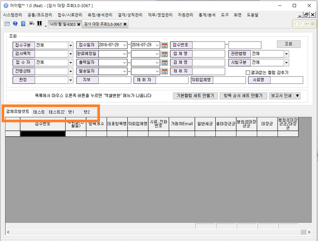
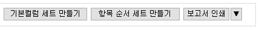
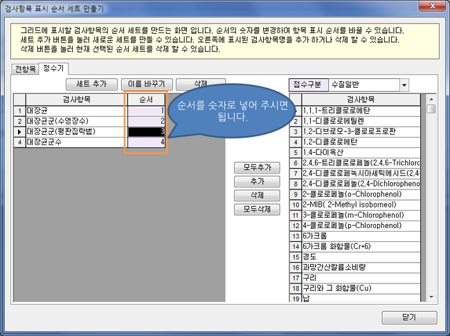

# 검사대장조회

아이랩에 접수된 항목에 대한 검사대장을 출력용지가 아닌 엑셀로 변환하여 저장할 때 사용하는 화면입니다.  
접수건, 항목, 항목 결과값이 한 행에 모두 조회가 되어지는 화면입니다. 단순 조회 -&gt; 엑셀변환 용도로만 사용하실 수 있습니다.  
한접수건에 모든 항목이 한 행 씩 나오길 원하신다면,  
측정/분석관리 -&gt; 접수구분별 검사 대장 조회\(=검사대장 3.0\) 화면을 이용해주세요.  
예\) 다른 기본 정보들은 아래쪽 화면 구성에서 참고하세요.

| 접수번호 | 항목1 | 항목2 | … |
| :--- | :--- | :--- | :--- |
| 접수번호1 | 성적서결과 | 성적서결과 |  |
| 접수번호2 | 성적서결과 | 성적서결과 |  |
| 접수번호3 | 성적서결과 | 성적서결과 |  |
| 접수번호4 | 성적서결과 | 성적서결과 |  |
| 접수번호5 | 성적서결과 | 성적서결과 |  |

※ 그리드의 컬럼 중 접수번호 ~ 거래처Email 부분까지는 고정이고, 거래처Email 오른쪽으로는 항목셋트에서 지정한 항목들이 나열됩니다.\(접수번호 컬럼은 고정입니다.\)

**화면구성-**

## 조회

항목 순서 세트 만들기를 통해 만들어진 각 항목 순서 탭을 선택하여 기본 정보 + 항목 정보를 조회합니다.

※ 선택한 항목 순서 세트에 따라 표기되는 항목이 다를 수 있습니다.

## 버튼설명

**기본 컬럼 세트 만들기**  
현재 사용하지 않는 기능입니다.

**항목 순서 세트 만들기**  
[항목 순서 세트 만드는 법](https://help.ilabs.co.kr/자주하는질문/004-16항목순서세트만드는방법.html)

**보고서 인쇄** 해당 버튼 클릭 시 아이랩 상단 메뉴 중 공통/코드관리 -&gt; 리포트관리화면에 등록 되어 있는  
“의뢰검사대장” 이라는 양식과 연결되어집니다.\(리포트관리 어느 탭에 있던 해양 양식의 이름을 찾아 연결합니다.\)  
조회된 목록의 모든 데이터를 선택한 지정된 양식으로 출력되기 때문에 조회된 데이터가 많은 경우, 다소 시간이 걸릴 수 있습니다.\(미리보기 -&gt; 출력\)

**▼ 버튼**  
위에 항목대장 양식이 아닌 다른 대장 양식을 선택하여 출력할 수 있습니다.  
아이랩 상단 메뉴 중 공통/코드관리 -&gt; 리포트관리 -&gt; 대장 탭에 등록되어있는 양식을이 팝업되어지고, 선택하여 출력합니다.

## 컬럼순서 바꾸기

**기능설명**  
접수구분별 검사대장 조회 화면의 컬럼 순서를 변경하는 방법에 대해 설명합니다.

**\(**

**1**

**\)**

** 접수정보 순서변경**

접수번호, 업체명, 접수구분, 접수일... 등 접수에 관한 컬럼을 이동할 수 있습니다.

① 키보드에서CTRL키를 누릅니다.

② CTRL키를 누른채로 이동을 원하는 컬럼의 제목부분을 마우스로 누릅니다.

③ 두개를 모두 누른채로 이동 합니다.

**\(**

**2**

**\)**

** 검사항목 순서변경**

검사항목 순서는 항목 순서세트 만들기에서 변경 할 수 있습니다.

① 화면에서 "항목 순서 세트 만들기"버튼을 클릭

② 검사항목의 표시 순서를 바꿀 수 있는 대화상자가 표시됩니다.

③ 순서를 바꿀 검사항목 세트 탭을 선택

④ 순서컬럼에 순서에 해당하는 숫자를 입력합니다.

⑤ 닫기 버튼을 누릅니다.

