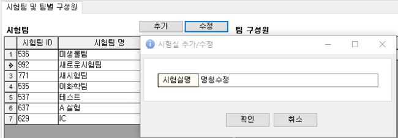
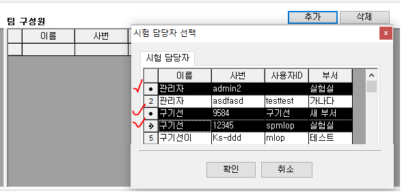

# 시험팀관리

## 시험팀관리

아이랩에서 접수되는 항목에 대하여 시험 담당자, 시험팀별 검토자, 분야별 승인자를 등록하는 화면입니다.

공통/코드관리 -&gt; 사용자 관리에 등록되어있는 사용자들만 등록을 할 수 있기 때문에 인원 추가가 필요하시다면

사용자 관리 화면에서 사용자를 추가 하신 후에 이용해 주세요.

시험팀별 검토자, 분야별 승인자는 각 시험팀과 각 분야별로 1명씩만 지정하실 수 있습니다.

\(시험팀이 다수라면, 시험팀 검토자는 각 시험팀별로 다르게 등록할 수 있습니다.\)


※3단 결재를 사용하지 않는 기관이라면 시험팀과 담당자만 등록하여 사용해 주세요.


이곳에 등록되어있는 시험팀, 항목 담당자는

1. 측정/분석관리 -&gt; 검사항목관리 -&gt; 실험팀배정 버튼
2. 접수/시료관리 -&gt; 각 접수화면에서 해당 접수건에 대한 각 시험팀, 담당자 변경 시에 사용할 수 있습니다.

\(접수화면에서 시험팀, 담당자 변경은 해당 접수건에만 적용됩니다.\)

접수된 항목에 대하여 항목 담당자가 아닌 다른 사람이 결과를 입력할 수도 있지만

기본적으로 항목 담당자가 지정 되어야 하기 때문에 이 화면에서 항목의 담당자를 지정할 수 있도록 미리 사용자를 등록해 두는 것입니다.

사용자관리 화면에 부서와 해당 화면의 시험팀 명칭은 서로 다른 부분이니 동일하지 않아도 됩니다.


※기접수건에 대하여 검토요청, 검토자결재가 진행된 다음 해당 화면에서 검토자, 최종승인자를 변경하는 경우에는 기접수건에 영향을 주지 않기 때문에 검토자, 분야별 승인자를 변경하고 싶다면 해당 화면에서 변경을 먼저 하시고 검토요청, 검토자 결재를 진행해주세요.


화면구성-

## 시험팀 추가 및 수정

**추가**

새로운 시험팀을 추가 합니다.

추가 버튼 클릭 이후 원하는 시험팀 명칭을 입력하고 확인 버튼을 클릭합니다.

새로운 시험팀이 생성되고, 내부적으로 시험팀 ID값이 부여됩니다.

**수정**

조회된 시험팀 목록 중에서 선택한 시험팀의 명칭을 수정합니다.

### 항목 담당자 추가 및 삭제

**추가**

선택한 시험팀에 새로운 항목 담당자를 추가합니다.

공통/코드관리 -&gt; 사용자 관리에 등록되어있는 사용자들만 등록을 할 수 있기 때문에 등록하려는 사용자가

조회 되지 않는 다면, 사용자 관리 화면에서 사용자를 추가하신 후에 이용해주세요.

**삭제**

선택한 항목 담당자를 최종 삭제 메시지 이후 시험팀에서 제거합니다.

삭제시 별도 이력을 남기지 않으니 참고해주세요.

※ 실수로 삭제하셨다면, 추가 버튼을 클릭하셔서 다시 추가하여 사용해주세요.

### 검토자 지정

선택한 시험팀의 검토자를 지정 및 변경합니다.

검토자 이름 부분에서 이름을 직접 입력하실 수도있고, 마우스로 선택하여 지정할 수도 있습니다.

검토자 이름을 지정한 다음 엔터키를 눌러 저장해주세요.

※ 변경 이후 시점부터 검토요청이 진행되는 항목들부터 변경된 검토자로 검토가 올라오게 됩니다. \(검토자 변경전에 이미 검토가 진행된 항목의 검토자는 변경되지 않습니다.\)

### 분야별 승인자\(최종승인자\) 지정

분야별 최종 승인자를 지정 및 변경 합니다. 시험팀 검토자와 마찬가지로

분야별 승인자 탭 -&gt; 이름 부분에서 이름을 직접 입력하실 수도 있고, 마우스로 선택하여 지정할 수도 있습니다.

분야별 최종 승인자의 이름을 지정한 다음 엔터키를 눌러 저장해주세요.

