# 결재관리

아이랩을 통해 3단 결재를 사용하는 기관에서 검토자, 승인자가 해당 항목에 대한 결재 처리를 하는 화면입니다.

※ 결재관리 화면은 그리드가 그룹으로 묶여 있기 때문에, 그리드 컬럼에 대한 위치 및 크기 저장이 불가능합니다.

그리드 조절이 필요 하신 경우, 결재관리2.0 화면을 이용해주세요.

\(결재관리2.0 메뉴가 보이지 않는다면, 서비스요청으로 문의해주세요. 기관에서 사용할 수 있는지 확인 후 답변 드리겠습니다.\)

※ 해당 화면 이용시 선행 조건

1. 기관내 3단 결재를 사용하고 있어야 합니다.\(시험, 검토, 승인\)
2. 측정/분석관리 -&gt; 시험팀 관리 -&gt; 각 시험팀에 검토자, 분야별 승인자가 등록되어 있어야 합니다.

**화면구성-**

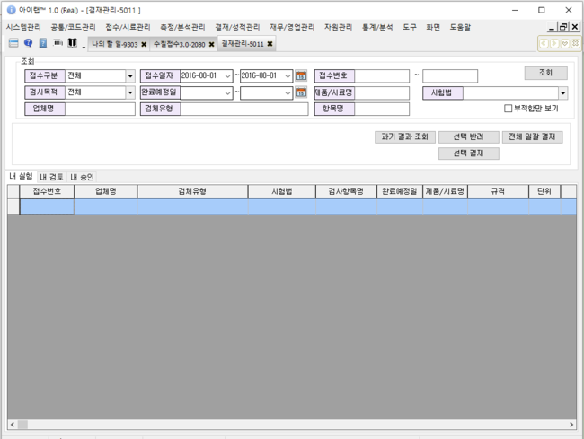

## 조회

**※ 각 탭별로 동작이 다르니 참고하세요.**

**내 실험**

현재 로그인 한 사람으로항목 담당자가 지정되어있고,결과값이 입력된 경우만 조회 됩니다.

**내 검토**

측정/분석관리 -&gt; 시험팀관리 -&gt; 시험팀 -&gt; 검토자가 현재 로그인 한 사람으로 지정 되어 있는 시점에,

해당 시험팀의 항목 담당자가 검토요청을 진행 한 항목만 조회 되어 집니다.

\(검토자가 자신으로 변경되기 전에 검토요청한 항목이라면 조회 되지 않을 수 있습니다.\)

예\)

측정/분석관리 -&gt; 시험팀관리 -&gt; 새시험팀에 사용자가 일반세균을 담당하고 있고, 결과 입력 후 검토요청을 진행하는 시점에 새 시험팀의 검토자에게 결재가 올라가게 됩니다.

항목담당자 구기선 -&gt; 검토자 구기선으로 결재 진행

**내 승인**

측정/분석관리 -&gt; 시험팀관리 -&gt; 분야별 승인자가 현재 로그인 한 사람으로 지정 되어 있는 시점에,

각 시험팀의 검토자가 결재를 진행 한 항목만 조회 되어 집니다.

\(분야별 최종 승인자가 자신으로 변경되기 전에 검토자가 결재한 항목이라면 조회 되지 않을 수 있습니다.\)

예\)

측정/분석관리 -&gt; 시험팀관리 -&gt; 미생물팀, 새시험팀이 모두 수질분야에 대한 실험을 진행하는 시험팀이라면 해당 팀들에서 진행되는 항목에 대한 검토자가 검토 결재를 진행하였다면 모두 분야별 승인자에 지정된 사용자에게 결재가 올라가게 되어집니다.

미생물팀 검토자 구기선, 새시험팀 검토자 구기선 -&gt; 분야별 승인자 구기선으로 최종 승인 요청

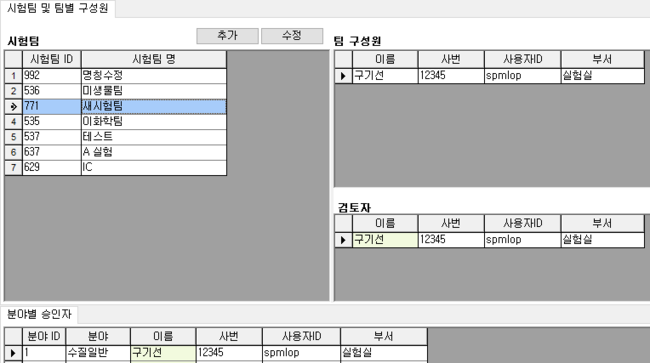

## 버튼설명

**과거 결과 조회**

선택한 항목에 대하여 과거에 결과값이 입력된 접수건이 있는지 조회하는 기능입니다.

내 실험, 내 검토, 내 승인 탭 어느곳에서나 사용할 수 있습니다.

\(결과값이 입력되어 판정이 적합 또는 부적합이 모두 나온 항목에 한하여 조회 됩니다.\)

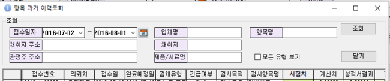

기본적으로 선택한 항목에대한 접수건 정보를 가지고 자동 조회합니다.

접수일자 : 아이랩 실행한 날짜의 -30일 ~ 현재 일자

업체명 : 선택한 접수건에 접수된 거래처 명칭

항목명 : 선택한 항목명

채취지 주소 : 선택한 접수건에 접수된 채취지 주소

**선택 반려**

결과값이 입력된 항목에 대하여 실험이 다시 진행되어야 하거나, 문제가 있는 경우 항목의 담당자에게 검사를 다시 진행할 수 있도록 처리합니다.

**선택 결재**

※ 각 탭별로 동작이 다르니 참고하세요.

**내 실험**

측정/분석관리 -&gt; 검사결과등록\(2.0, 3.0, 4.0\) 화면 등에서 항목에 대한 검토요청을 진행하는 것과 같은 기능입니다.

선택한 항목\(들\)에 대하여 검토요청을 진행합니다.

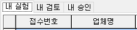

**내 검토**

선택한 항목\(들\)에 대하여 검토승인을 진행하고, 분야별 최종승인자\(최종 승인자\)에게 결재를 요청합니다.

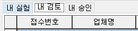

**내 승인**

선택한 항목\(들\)에 대하여 최종승인을 진행하고 실제 성적서를 발행 할 수 있는 상태를 만듭니다.

\(접수건의 모든 항목에 대한 최종승인이 끝난경우 접수건의 상태가 “승”상태로 변경됩니다.\)

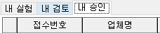

**전체 일괄 결재**

※ 각 탭별로 동작이 다르니 참고하세요.

※ 일괄로 진행하는 부분이기 때문에, 사용전 반드시 조회된 내용을 검토해보시고 진행하세요.

내 실험 : 조회된 내용의 모든 항목들에 대하여 일괄 검토요청을 진행합니다.

내 검토 : 조회된 내용의 모든 항목들에 대하여 일괄 검토결재를 진행하고, 분야별 최종승인자\(최종승인자\)에게 결재를요청합니다.

내 승인 : 조회된 내용의 모든 선택한 항목\(들\)에 대하여 최종승인을 진행하고, 실제 성적서를 발행 할 수 있는 상태를만듭니다.

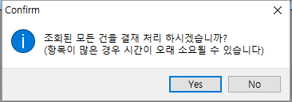

## 의견 남기기\(검토자,승인자\)

## 검토자 또는 승인자 의견 남기기

검토자 또는 승인자가 선택한 항목에 대한 참고사항이 필요한 경우, 메모를 입력하고 승인 또는 반려를 진행합니다.

해당 의견들은 결재/성적관리 -&gt; 성적서 관리 화면 하단 -&gt; 해당 항목 부분에 표기되어 집니다.

&lt;내 검토&gt;

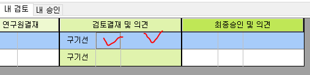

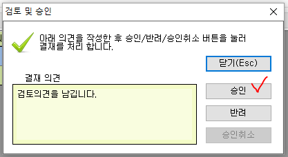

&lt;내 승인&gt;

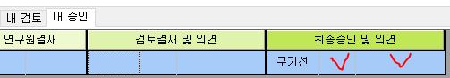

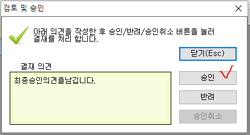

&lt;성적서관리 화면&gt;

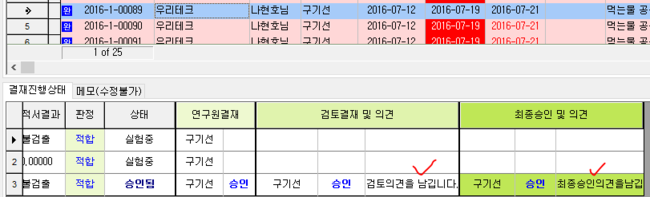

