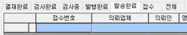
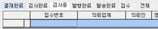
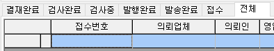
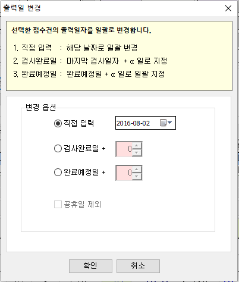
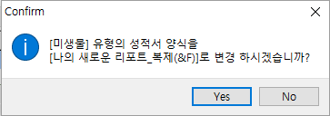
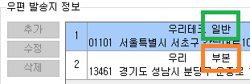

# 성적서관리

접수된 접수건에 대하여 성적서를 발행 및 성적서와 관련된 작업들을 진행하는 화면입니다.

통합접수목록에서도 성적서 출력이 가능하지만, 해당 화면은 성적서 출력 최적화를 목적으로 개발되었습니다.

\(통합접수목록 화면은 성적서 출력 이외에 다양한 기능들이 통합되어있습니다.\)

**화면구성-**

## 조회

화면 중앙에 위치한 각 탭별로 접수건의 상태를 나타냅니다.

상단에 조회 조건에 따라 접수건을 조회하며, 선택한 탭 = 조회 조건에 입력된 접수건의 상태를 의미합니다.

전체 탭은 각 접수건의 상태와 관계 없이, 조회 조건에 입력된 모든 접수건을 조회합니다.

|  |  |
| :--- | :--- |
|  |  |
|  |  |

조회 목록 중 접수번호 왼쪽에 메모 아이콘은 해당 접수건에 "접수메모"가 입력 되어 있는 경우에만 표기되어집니다.

메모 아이콘을 마우스 왼쪽 버튼으로 클릭하여 메모를 확인 할 수 있고, 화면 하단에 메모\(수정불가\) 탭으로 확인 할 수 도 있습니다.

**화면 하단**

조회 조건 입력 후 선택한 탭에 따라 접수건이 조회 되며, 조회 목록에서 선택한 접수건에 대한 항목 정보, 항목에 대한 결재정보가 하단에 표기됩니다.

또한 해당 접수건의 접수메모, 업체메모를 확인해 볼 수 있습니다.

&lt;결재진행상태&gt;

&lt;메모\(수정불가\)&gt;

## 버튼설명

**성적서묶기**

**성적서풀기**

**출력일 변경**

선택한 접수건에 대하여 성적서에 표기하는 출력일자를 변경하는 기능입니다.

※ 각 접수건의 최초 성적서 발행시에는 각 접수건에 따라 자동으로 출력일자가 부여됩니다.

※ 접수건의 상태가 “발” 이상의 접수건에 한해서만 변경이 가능합니다.

\(접수건의 상태가 “승” 이상의 상태 일때도 변경하고 싶다면 서비스요청으로 문의해주세요.\)

종이 출력 이전에 출력일을 변경하고 싶다면, 성적서 가상 출력 기능 이후에 출력일을 변경하여 출력해주세요.

출력일 변경 팝업창에서 원하는 조건을 선택 -&gt; 변경하고 싶은 날짜로 변경 -&gt; 확인 버튼 클릭

**발행 초기화**

선택 한 접수건의 상태가 성적서 발행이 끝난 “발” 인 경우 해당 기능을 이용하여 발행을 초기화 하여 “승” 상태로 변경해 주는 기능입니다. 상태가 변경되더라도, 출력이력이 남아있기 때문에 필요에 따라 확인해볼 수 있습니다.

\(성적서관리 화면 -&gt; 해당 접수건 조회 및 선택 -&gt; 발행이력 버튼 클릭\)

**성적서 양식 변경**

선택된 접수번호에 연결 되어 있는 검체유형에서 지정한, 기본 성적서 양식을 지정 및 변경합니다.

※ 검체유형에 기본 성적서가 연결 되어 있더라도 ▼ 버튼을 통하여 다른 양식을 선택, 출력할 수 있습니다.

공통/코드관리 -&gt; 리포트관리 -&gt; 성적서 탭에 등록되어있는 양식들이 팝업 되어 지고, 양식을 선택한다면

해당 검체유형의 접수건은 “성적서발행” 버튼으로 성적서 출력이 가능합니다.

\(성적서 발행 버튼은 검체유형에서 지정한 성적서로만 출력할 수 있습니다. 별도 양식 선택은 ▼버튼을 이용하세요.\)

해당 기능은 측정/분석관리 -&gt; 검사항목관리2.0 에서도 진행 하실 수 있습니다.

&lt;리포트 관리 -&gt; 성적서 탭&gt;

예\) 해당 검체유형에 연결된 리포트양식을 나의 새로운 리포트 -&gt; 나의 새로운 리포트\_복제 로 변경

&lt;양식을 변경 할 검체유형이 접수된 접수건 선택&gt;

&lt;성적서 양식 변경 버튼 클릭 -&gt; 변경할 성적서 양식 선택&gt;

&lt;메시지 확인&gt;

&lt;양식 변경 확인&gt;

※ 해당 검체유형으로 접수된 모든 접수건이 변경되어집니다.

**성적서 가상 출력**

종이 성적서를 발행하기 전 출력일을 변경하고자 할 때 사용합니다.

접수건의 상태를 “승” -&gt; “발“ 상태로 변경해주는 기능만 있습니다.

※ 결재완료 탭에서만 사용가능합니다. \(접수건의 상태가 “승” 인 경우\)

아이랩에서는 접수건의 상태가 “발” 이상일 때만 출력일을 변경할 수 있기 때문입니다.

\(접수건의 상태가 “승” 이상의 상태 일때도 변경하고 싶다면 서비스요청으로 문의해주세요.\)

**리포트 디자인**

선택된 접수번호에 연결 되어 있는 검체유형에서 지정한, 기본 성적서 양식의 수정이 필요한 경우 직접 수정 할 수 있도록 하는 기능입니다.

\(공통/코드관리 -&gt; 리포트관리 -&gt; 성적서 탭 -&gt; 해당 성적서 선택 -&gt; 리포트 디자인 버튼과 동일한 동작입니다.\)

만약 수정하셨다면 성적서 출력 테스트 후, 다시 한번 리포트 디자인 버튼을 클릭 -&gt; 해당 양식을 업로드 해주셔야 기관 내 다른 사용자들에게도 공유되어집니다.

**주소라벨**

공통/코드관리 -&gt; 리포트관리 -&gt; 라벨 탭에 등록 되어 있는 라벨 용지를 출력합니다.

**성적서 발행**

“성적서 발행” 버튼은 검체유형에 연결 되어 있는 성적서로만 출력할 수 있습니다.

\(해당 버튼을 사용하시려면 검사항목관리2.0에서 해당 검체유형에 양식 연결 또는 “성적서 양식 변경” 기능을 이용한 뒤 출력하세요.\)

별도 양식 선택은 ▼ 버튼을 이용하세요.

※ 검체유형에 기본 성적서가 연결 되어 있더라도 ▼ 버튼을 통하여 다른 양식을 선택, 출력할 수 있습니다.

**출력 옵션    
**

| 통합접수목록 | 성적서관리 |
| :--- | :--- |
|  |  |

* 발송지별 출력 : 같은 접수건이라도 접수건에 우편발송지 정보가 2개 이상일 때 선택하여 출력 할 수 있습니다. 아무것도 선택되지 않은 경우 일반 발송지로 적용됩니다.
* * 모든발송지 - 아래와 같은 경우 라면 같은 접수건에 다른 주소로 2장이 출력됩니다.
  * 일반 발송지 - 아래와 같은 경우 라면 일반으로 저장되어있는 주소로 1장이 출력됩니다.
  * 부본 발송지 - 아래와 같은 경우 라면 부본으로 저장되어있는 주소로 1장이 출력됩니다.

    
* 판정하지 않고 발행 : 성적서상에 적합,부적합을 표기하는 부분에 기본적으로 공란을 표기하고, 특정 양식에 원하는 문구를 지정할 수도 있습니다.
* 배경이미지 출력 : 각 양식 또는 기관에서 지정한 배경이미지를 표기하여 출력합니다.
* 결재성적서 : 결재 표기 여부를 체크합니다.\(각 양식에 별도 작업이 되어있는 경우에만 동작합니다.\)
* PDF 변환 : 선택한 접수건을 미리보기, 종이 인쇄를 하지 않고, 바로 PDF 파일로 변환할 때 사용합니다. \(선택한 접수건이 많은 경우, 변환 시간이 다소 소요 될 수 있습니다.\)

**발행 이력**

해당 접수건으로 성적서가 발행되었던 이력을 확인 할 수 있습니다.

발행 이력 목록에서 발행시점을 더블클릭하면, 해당 발행시점에 발행되었던 성적서 이미지로 확인할 수 있습니다.

※ 아이랩 서비스 유지 관리에 따라 이미지 저장 기간은 90일로 제한 될 수 있습니다.

## 추가기능

**더블클릭시 동작**

**성적서 미리보기**

해당 옵션을 선택 후 접수건을 마우스로 더블클릭 한다면, 해당 접수건에 연결된 검체유형에 지정된 성적서를 미리 보기 합니다.\(성적서 발행 버튼과 동일한 동작입니다.\)

**접수로 이동**

해당 옵션을 선택 후 접수건을 마우스로 더블클릭 한다면, 접수화면으로 이동하여 조회하게 됩니다.

**성적서 출력 여부\(각 접수건, 각 항목 설정\)**

※ 각 접수건 각 항목에만 적용됩니다.

선택한 접수건의 항목을 성적서에 표기할지 설정하는 기능입니다.

체크가 해제 된 항목은 성적서에 표기되지 않습니다.

해당 접수건에만 적용되어지기 때문에 많은 접수건에 일괄 적용하시려면 아래 순서로 진행해주세요.

측정/분석관리 -&gt; 검사항목관리2.0 -&gt; 해당 검체유형 선택 -&gt; 출력 하지 않을 항목의 성적서 출력 여부를 체크 해제 -&gt; 해당화면으로이동 -&gt; 성적서 출력

